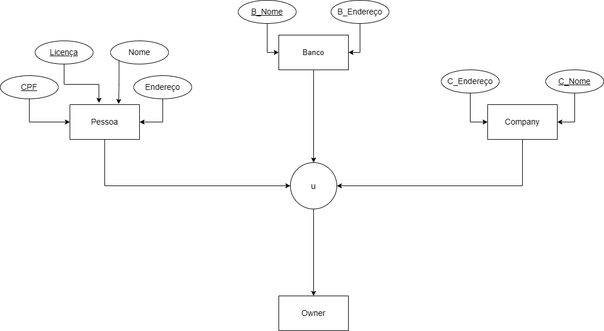
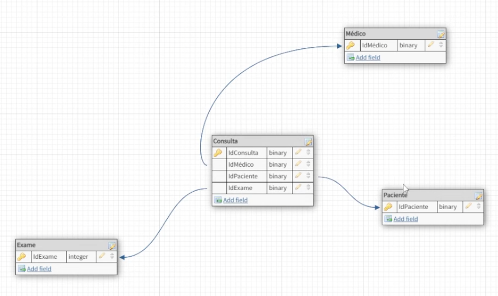

# Refinando um Projeto Conceitual de Banco de Dados – E-COMMERCE

## DIAGRAMAS CRIADOS

    
     
    

## DESAFIO

### Levantamento de Requisitos

### Refinando

Refine o modelo apresentado acrescentando os seguintes pontos:

* Cliente PJ e PF – Uma conta pode ser PJ ou PF, mas não pode ter as duas informações;

* Pagamento – Pode ter cadastrado mais de uma forma de pagamento;

* Entrega – Possui status e código de rastreio;